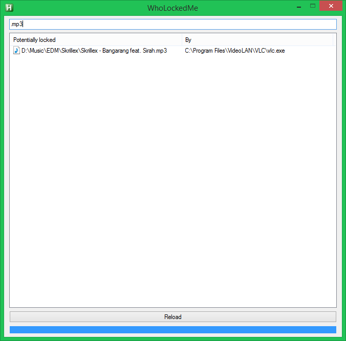
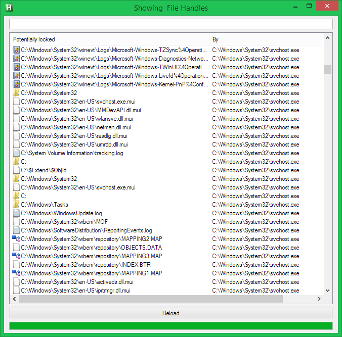
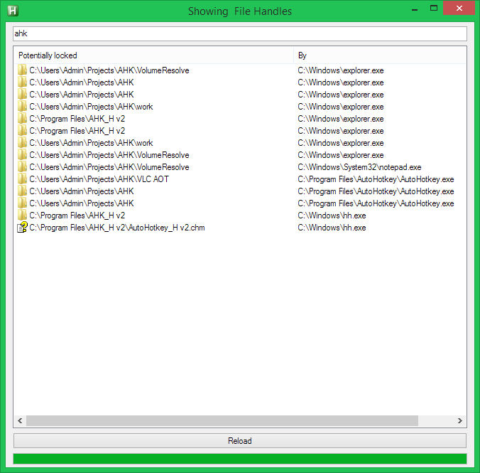

## WhoLockedMe

#### Credits
 * Credits to HotkeyIt for the super complicated handle retrievement!
 * Credits to jNizM for the neat QueryDosDevice function!
 * Credits to Lexikos and "just me" for the GetIconGroupNameByIndex fucntion!
 * Credits to "just me" for translating the whole script into AHK 1.1 and also for GetPathNameByHandle and GetIconByPath!
 * If I forgot to put *your* name into this list, tell me please!
 
#### Links
 * [Development topic on autohotkey.com](https://autohotkey.com/boards/viewtopic.php?p=80447)
 * [Release topic on autohotkey.com](https://autohotkey.com/boards/viewtopic.php?p=80455)
 * [The C++ code that has been translated to AHK code for the handle retrievement](http://forums.codeguru.com/showthread.php?176997.html)

#### Requirements
The script requires AHK 1.1. An older version that works for AHK_H can be found in the subfolder /AHK_H.
If you just want to test it you can download the compiled version. (See link below)

#### Future ideas include:
- only show handles that are definitely locking a file
- option to force a process to release a certain handle
- option to close all handles responsible for keeping a device from ejecting
- another tab that shows which process is responsible for blocking which port
- option to force a process to stop listenting on a certain port

#### Downloads
[Downlaod compiled version](WhoLockedMe.exe?raw=true)  
[Downlaod reporsitory](https://github.com/T-vK/WhoLockedMe/archive/master.zip)

#### Screenshots

