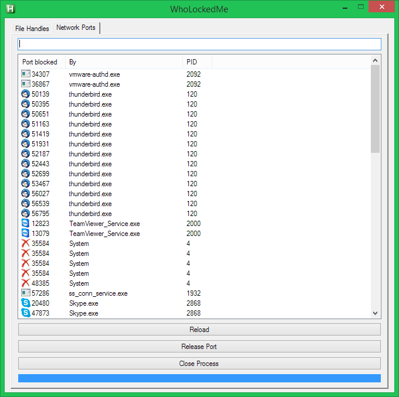

## WhoLockedMe

#### What does it do?
This tool shows you a list of all files that are currently being used by any process.  
Using the instant filter you can easily find out what is responsible for locking a file,
disallowing you to delete it or even to eject a certain USB device.
Using this tool you can now easily find files/folders that are being locked and release them with a click of a button.

It now also shows which process is blocking which port.

#### Credits
 * Credits to HotkeyIt for the super complicated handle retrievement!
 * Credits to "just me" for translating all the handle retrievement stuff into AHK 1.1 and also for GetPathNameByHandle and GetIconByPath and other valuable info about icons in AHK and File System Redirection!
 * Credits to jNizM for a lot of valuable input and research and fine-tuning of GetExtendedTcpTable and GetProcessFilePath! 
 * If your name, someone elses name or anything else is missing from this list, tell me please!

#### Links
 * [Development topic on autohotkey.com](https://autohotkey.com/boards/viewtopic.php?p=80447)
 * [Release topic on autohotkey.com](https://autohotkey.com/boards/viewtopic.php?p=80455)
 * [The C++ code that has been translated to AHK code for the handle retrievement](http://forums.codeguru.com/showthread.php?176997.html)

#### Requirements
The script requires AHK 1.1. An older version that works for AHK_H can be found in the subfolder /AHK_H.
If you just want to test it you can download the compiled version. (See link below)

#### Future ideas include:
- only show handles that are definitely locking a file
- in the network port tab, show more info like IP addresses and remote ports
- also show udp ports, not only tcp
- option to force a process to stop listenting on a certain port
- context menu for the listview
- smaller buttons

#### Downloads
[Download latest version of the script](WhoLockedMe.ahk?raw=true)  
[Downlaod compiled 32bit version](WhoLockedMe.exe?raw=true)  
[Downlaod compiled 64bit version](WhoLockedMe_64bit.exe?raw=true)  
[Downlaod reporsitory](https://github.com/T-vK/WhoLockedMe/archive/master.zip)

#### Screenshots

